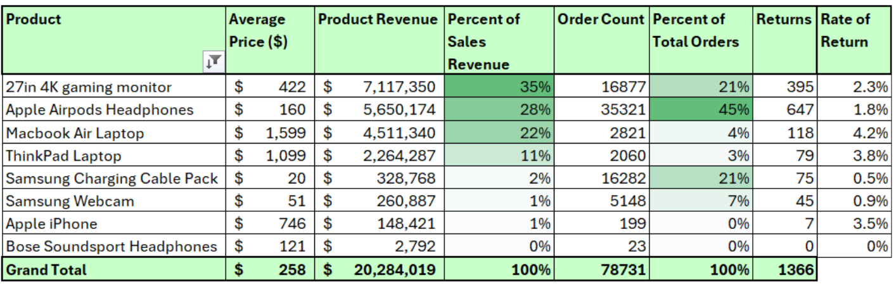

# AN Anlysis of Tech Haven's Ecommerce Performance from 2019 to 2022
## Background
Tech Haven is an e-commerce brand specializing in popular mobile electronics. This analysis aims to inform the executive leadership team about revenue trends, product sales performance, and the impact of the loyalty program. The insights and recommendations provided are intended to enhance performance across sales and marketing efforts.

Specific Stakeholder Questions

This section represents the specific questions and requests that stakeholders have given to the data team. It is here to provide traceability and accountability for this project. 
**Sales Trends**
1. What were Tech Haven's sales revenue trends between 2019 and 2022?
2. During which month do we see our highest/lowest revenue?
3. What is the Average Order Value (AOV)?

**Consumer Behavior**
4. Which marketing channel brings us the most customers?
    > Sales %, AOV, Order Count
    > Could also look at platforms: Website vs. mobile
    > Marketing Worksheet
      > Marketing spend and ROI
5. Which country/region has the most customers?
    > Consumption trends
    > Maybe a geographic heat map in the future
6. Has the loyalty program improved Total Revenue and Average Order Value (AOV)?
    > Do loyalty members outpace  non-loyalty members in sales rev, AOV, or orders placed?

**Products and Refunds**
7. Which products have generated the highest/lowest revenue? 
8. Investigate refund rates and report on general trends.
    > Double down on what's working
    > Each products total rev, Order Count, and refund rate
    > Product and AOV Worksheet

## Executive Summary

## Description of Data

## Insights Deep Dive
### Sales Trends

### Consumer Behavior
#### Marketing

#### Regions
\

#### Loyalty Program

### Products and Refunds

## Recommendations

## Questions, Feedback, and Limitations
### Questions for Stakeholders

### Feedback on Data Quality

### Limitations
