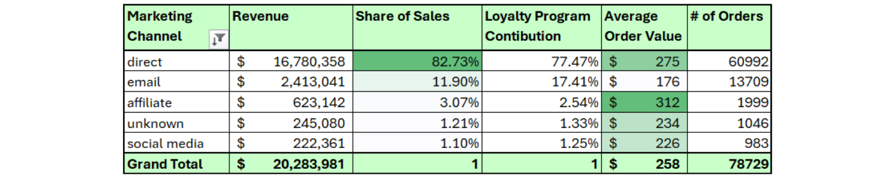
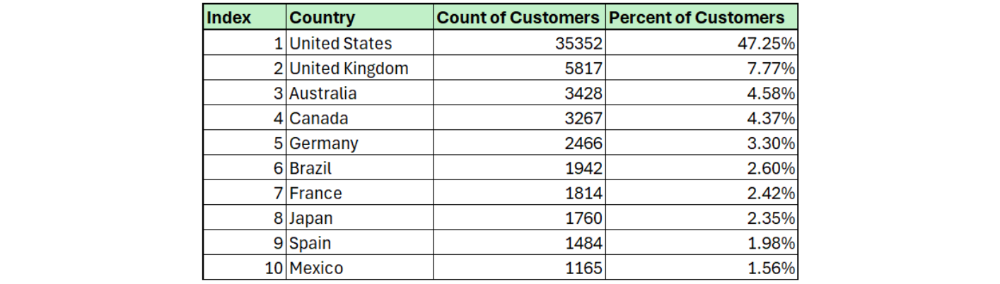

# Performance Analysis of Tech Haven’s Ecommerce Operations (2019–2022)
## Background
This performance report was prepared for the executive leadership team of Tech Haven, an e-commerce brand specializing in popular mobile electronics. This report uses Tech Haven's in-house data to investigate:
- Overall sales trends
- Marketing channels that drive Tech Haven's web traffic
- The geographic distribution of customers
- Results driven by the loyalty program 
- Best and worst performing products

 The insights and recommendations provided are intended to enhance performance across sales and marketing efforts.

Specific Stakeholder Questions

This section represents the specific questions and requests that stakeholders have given to the data team. It is here to provide traceability and accountability for this project. 

**Sales Trends**

1. What were Tech Haven's sales revenue trends between 2019 and 2022?
2. During which month do we see our highest/lowest revenue?
3. What is the Average Order Value (AOV)?

**Consumer Behavior**

4. Which marketing channel brings us the most customers?
5. Which country/region has the most customers?
6. Has the loyalty program improved Total Revenue and Average Order Value (AOV)?

**Products and Refunds**

7. Which products have generated the highest/lowest revenue? 
8. Investigate refund rates and report on general trends.

---
## Table of Contents

1. [Executive Summary](#executive-summary)
2. [Insights Deep Dive](#insights-deep-dive)
   - [Sales Trends](#sales-trends)
     - [Overview of Revenue Trends (2019–2022)](#overview-of-revenue-trends-2019-2022)
     - [Seasonality and Revenue Growth Patterns](#seasonality-and-revenue-growth-patterns)
     - [Order Volume and Average Order Value (AOV)](#order-volume-and-average-order-value-aov)
     - [Summary of Sales Trends Analysis](#summary-of-sales-trends-analysis)
   - [Consumer Behavior](#consumer-behavior)
     - [Marketing](#marketing)
     - [Geographic Distribution of Customers](#geographic-distribution-of-customers)
     - [Loyalty Program](#loyalty-program)
     - [Summary of Consumer Behavior](#summary-of-consumer-behavior)
   - [Products and Refunds](#products-and-refunds)
     - [Overview](#overview)
     - [Sales Performance](#sales-performance)
     - [Summary and Key Takeaways](#summary-and-key-takeaways)
3. [Recommendations](#recommendations)
4. [Questions and Limitations](#questions-and-limitations)
   - [Questions for Stakeholders](#questions-for-stakeholders)
   - [Limitations: Data Quality and Completeness](#limitations-data-quality-and-completeness)

## Executive Summary
Tech Haven’s performance analysis from 2019 to 2022 highlights key opportunities and challenges in sales, marketing, and product strategy. While revenue grew 41% since 2019, sales have declined steadily post-pandemic, with December consistently underperforming, indicating missed opportunities during the holiday season. Direct marketing drives the majority of sales, though affiliate marketing offers untapped potential with the highest Average Order Value (AOV) at $312. The loyalty program, despite its large membership base, underperforms, as members contribute less revenue, have lower AOVs, and higher refund rates compared to non-members. Product performance is dominated by high-revenue items like the 27in 4K Gaming Monitor and Apple AirPods, while low-volume products such as Bose Headphones and Samsung Charging Packs contribute minimally. To address these issues, strategic focus on optimizing Q4 marketing, expanding affiliate efforts, refining the product lineup, and redesigning the loyalty program is recommended to drive growth and improve customer engagement.

## Insights Deep Dive
### Sales Trends
#### Overview of Revenue Trends (2019–2022)

Tracking with macroeconomic trends, revenue peaked dramatically in March 2020 with $797k in sales revenue, coinciding with lockdowns in the United States. The overall trend is upwards when considering 2019 as the starting point, with total revenue in 2022 reaching $3.79M, a 41% improvement over the $2.70M generated in 2019. However, compared to the industry’s average Compounding Annual Growth Rate (CAGR) of 14.4%, which projects a 52% increase over the same period ([USITA](https://www.trade.gov/ecommerce-sales-size-forecast)), Tech Haven (TH) appears to be slightly underperforming.

It is important to note that the upward trend is only evident when 2019 serves as the baseline. If 2020 is used as the baseline, the trend becomes negative. This shift highlights the challenge of maintaining growth momentum following the pandemic-driven surge.

#### Seasonality and Revenue Growth Patterns

- Seasonality plays a significant role in revenue fluctuations:
    - Strong growth rates are observed consistently in Q2 and early Q4.
    - Q3 shows negative growth rates across all years in the dataset.
- In 2023, Q4 experienced declines in monthly revenue, diverging from the usual winter growth observed in previous years.

*Figure 1 and 2: Month to Month Sales Revenue and Growth Rates* 

Observations - Figure 1 and 2:

- Sales peaked in May for 2019, 2020, and 2022. In 2021, the peak month was April.
- The worst-performing month for every year in this dataset was December, contrary to typical retail trends.
- 2023 exhibited less volatility compared to prior years.

#### Order Volume and Average Order Value (AOV)

*Table 1: Overall Sales Trends from 2019 to 2022*

Observations - Table 1:

- Average Order Value (AOV) and the number of orders increased during 2020 and 2021.
    - While the distribution of the number of sales remained consistent during these times, the higher volume of more expensive items raised the AOV. See Table 7 for distribution.

#### Summary of Sales Trends Analysis

Tech Haven saw significant growth during the pandemic but has faced challenges sustaining that growth in a post-pandemic environment. Seasonality continues to influence revenue, but recent declines in Q4 performance and lower AOV in 2022 suggest the need for new strategies to improve product offerings and maintain customer engagement.

### Consumer Behavior
#### Marketing

Contibuting $16.7M in sales, direct marketing is by far TH's largest channel. Email provides an outsized impact in building the loyalty program relative to the other channels. Email has contributed 17% of the Loyalty Program memberships while only contributing 12% to sales.

No data has been provided to define how much has been spent on each channel and the actual campaigns that have been attempted. Overall, it is difficult to draw conclusions without knowing more about these critical variables.

*Table 2: Relative Contribution of Marketing Channels to Sales and Loyalty Program*

Observations - Table 2:

- At $312, AOV is highest with the affiliate marketing channel, almost doubling the AOV of the email channel.
- Email, while effective for driving loyalty memberships, has a relatively lower AOV compared to other channels.

#### Geographic Distribution of Customers

Tech Haven’s customer base spans 188 countries, but the Pareto principle applies here:Just 5% of countries generate nearly 80% of sales.

*Table 3: Top 10 Countries Represented by User Profiles*

Performance Insights:

- Outperforming Markets:
    - The United Kingdom (ranked 4th globally in ecommerce markets) shows strong performance relative to its market size.
    - Australia, despite not being in the top 10 global ecommerce markets, contributes significantly to sales, suggesting effective penetration or brand affinity in this region.

- Underperforming Markets:
    - Tech Haven shows weaker results in the Asia Pacific Region, a key growth area for global ecommerce ([Shopify](https://www.shopify.com/blog/global-ecommerce-sales#)).

#### Loyalty Program

Currently, 41% of Tech Haven's customers participate in the loyalty program.

*Table 4: Comparison of Performance of Profiles that Participate in Loyalty Program and Do Not Participate*

However, their impact on overall sales is somewhat limited:

- Loyalty program members contribute only 38% of sales ($7.8M).
- Their Average Order Value (AOV) is $32 lower than that of non-loyal customers.
- Loyalty program members also account for 58 more refunds during the reporting period.

Additionally, the number of customers who both return and participate in the loyalty program is notably low, at **55 out of 32,630** (0.17%) total customers.

*Figure 3 and 4: Comparison of Sales Performance and AOV for Loyal and Non-Loyal Profiles* 

Observations - Figures 3 and 4:

- Customers outside the loyalty program consistently contribute a greater proportion of sales revenue than loyalty program participants.
- In Q2 2021, revenue from both groups began a downward trend, reflecting broader sales challenges.
- Loyalty members do not outperform other customers in terms of AOV, signaling limited value from the program in driving higher spending.

*Table 5: New and Repeat Customers from 2019 to 2022*

Observation - Table 5:

- The ratio of repeat customers to total customers has been declining since 2019, potentially indicating a lack of retention strategies or loyalty program effectiveness.

#### Summary of Consumer Behavior
Tech Haven’s consumer behavior reveals several key insights: direct marketing drives significant sales, with email excelling at building loyalty but underperforming in revenue efficiency compared to affiliate marketing. Geographically, sales are concentrated in a small number of countries, with strong performance in the UK and Australia but missed opportunities in the Asia Pacific region. The loyalty program underdelivers, as members contribute less revenue and lower AOV compared to non-members, while repeat customer ratios have been steadily declining since 2019. These trends highlight opportunities to optimize marketing channels, expand geographically, and revamp loyalty strategies to enhance customer retention and value.

### Products and Refunds

#### Overview

Tech Haven's product sales are dominated by a few key items, with notable differences in their sales contributions and return rates. Overall, higher-end products such as laptops and monitors form the bulk of sales revenue. Naturally, these higher end items form the bulk of returns, as well. 

#### Sales Performance

*Table 6: Sales Performance for Each Product*

Observations - Table 6:

- The 27in 4K Gaming Monitor is the top performer, contributing 35% of total revenue ($7.1M), with a low return rate of 2.3%.
- Apple AirPods Headphones account for 28% of sales revenue ($5.65M) and have the largest share of total orders (45%).
- Products like the Samsung Charging Cable Pack and Samsung Webcam contribute smaller portions of sales, at 2% and 1%, respectively, with low return rates (<1%).
- The MacBook Air Laptop, despite generating $4.5M in revenue, has the highest return rate at 4.8%, indicating potential issues with customer satisfaction or product suitability.

*Table 7: Count of Each Product Sold Every Year*

Observations - Table 7:

- Demand across the entire product lineup increased by 38% in 2020.
- The Samsung Webcam, introduced in 2020, sold 5,148 units by 2022, compared to just 23 units sold for Bose Headphones over the same period.
- Apple AirPods Headphones are the top-selling product, with 35,321 units sold across all years, while Bose SoundSport Headphones are the lowest-selling item, with only 23 units sold in total. 

#### Summary and Key Takeaways

Tech Haven's product portfolio is concentrated around a few high-performing items like the 27in 4K Gaming Monitor and Apple AirPods Headphones, which together drive a majority of revenue. Since 2020 sales have declined for all products.

## Recommendations
1. Revamp Q4 Marketing Strategy

    **Action:** Investigate Q4 marketing efforts and adjust strategies to maximize sales during the "Golden Quarter."
    **Rationale:** Despite the typical Q4 sales peak for ecommerce, Tech Haven consistently underperforms, with December being the worst month every year. This could be due to heavy reliance on direct traffic rather than competitive advertising and promotions. By increasing Q4 ad spend and leveraging Black Friday, Cyber Monday, and Christmas campaigns, Tech Haven could better capture holiday sales.

2. Expand Affiliate Marketing Efforts

    **Action:** Run a multi-quarter experiment to increase investment in affiliate marketing and measure its impact on traffic and sales.
    **Rationale:** Affiliate marketing, despite having the highest AOV ($312), contributes only 3% of revenue. The high AOV likely reflects the focus on higher-priced products incentivized by affiliate commissions. Expanding this channel could attract high-value customers and boost revenue.

3. Rebuild Product Portfolio

    **Action:** Cut the bottom-performing products (Samsung Charging Pack, Samsung Webcam, iPhone, Bose Headphones) and expand offerings in successful categories such as laptops, monitors, and small headphones.
    **Rationale:** The bottom four products contribute just 4% of revenue, while the top categories (laptops, monitors, headphones) dominate sales. Streamlining the portfolio would allow Tech Haven to focus resources on its most profitable segments.

4. Reassess or Overhaul the Loyalty Program

    **Action:** Either eliminate or redesign the loyalty program to improve its effectiveness.
    **Rationale:** Loyalty program participants generate 38% of sales despite making up 41% of customers, have a lower AOV ($32 less) than non-loyal customers, and account for more refunds. The current program fails to drive higher spending or retention.

5. Investigate Declining Repeat Customer Rates

    **Action:** Conduct surveys or interviews to collect data on customer satisfaction and identify reasons for the drop in repeat customers.
    **Rationale:** The ratio of repeat customers has fallen by 4% (224 fewer repeat customers), despite a growing customer base. Understanding and addressing this trend could help improve customer retention and long-term profitability.

## Questions, and Limitations
### Questions for Stakeholders
1. Has Tech Haven ever conducted a customer satisfaction assessment?
2. How is data captured in the `marketing_channel` field in the `customers` table?
3. No refunds were recorded for 2022. Is this an accurate representation of reality, or a lack of tracking?

### Limitations Data Quality and Completeness
Data Quality:
- There is a direct correlation between `marketing_channel` and `account_creation_method` in the `customers` table. This indicates possible corruption, or a flaw in data collection process. 
- Several foreign currencies do not convert to USD. This could lead to issues with data tracking in the future. The list is available in the data/clean/data_cleaning.md file.

Completeness:
- Lack of data related to cost of items and fulfillment. 
- No data on marketing:
    - Investment in each channel
    - Types of campaigns conducted
    - Specifics of execution

